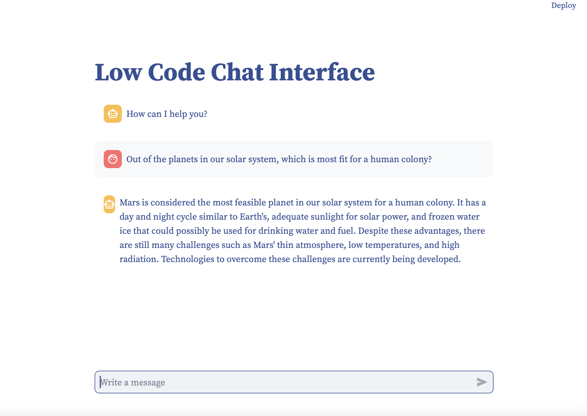

[](https://rental-floorplans-brianlesko.streamlit.app)
# Low-Code-Chat
This git repository hosts a user interface for a chat-app written in [Pure Python](https://github.com/BrianLesko/Low-Code-Chat/blob/main/low-code-chat.py) with less than 50 lines of  code. Connect your OpenAI API for Chat-GPT like chatting. Created for Learning Purposes, this repo has a focus on correct respo structure.



## Repository Structure
```
Low-Code-Chat/
├── .streamlit/
│   ├── config.toml
│   └── secrets.toml # Make sure to add this to gitignore! Or your personal API key becomes public when pushed. 
├── docs/
│   └── content.png
├── app.py
├── requirements.txt
└── .gitignore
```

## Run this demo locally
```
pip install --upgrade streamlit
streamlit run https://github.com/BrianLesko/Low-Code-Chat/blob/main/low-code-chat.py
```

## Topics 
Python | Streamlit | Git | Low Code UI
Template Repository | Streamlit Secrets | Chat interface | LLM

## About

Hey it's Brian, check out my social profiles. 

</a> &nbsp; &nbsp; &nbsp; &nbsp; &nbsp; &nbsp; <a href="https://github.com/BrianLesko"></a> &nbsp; &nbsp; &nbsp; &nbsp; &nbsp; &nbsp; <a href="https://www.linkedin.com/in/brianlesko/"></a>

