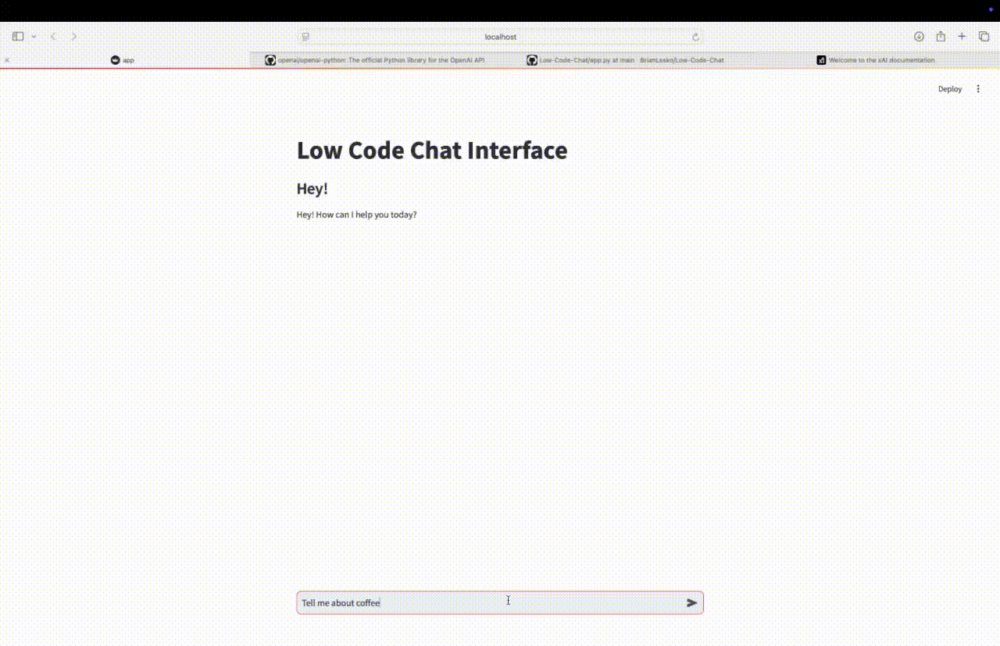

# Low Code Chat UI
This git repository hosts a user interface for a chat-app written in [Pure Python](https://github.com/BrianLesko/Low-Code-Chat/blob/main/low-code-chat.py) with less than 100 lines of code. Xai vision model supported. Connect your OpenAI API or XAI API for Chat-GPT like chatting. Created for Learning Purposes.

&nbsp;

<div align="center"></div>

&nbsp;

## Repository Structure
```
Low-Code-Chat/
├── .streamlit/
│   └── config.toml
├── app.py
├── start.sh
├── keys.json
│   └── {"xai_api_key": "xghsipoksml...", "openai_api_key": "xfughsipoksml..." }
├── requirements.txt
└── .gitignore
```

&nbsp;

## Run this demo locally
```
pip install --upgrade streamlit
streamlit run https://github.com/BrianLesko/Low-Code-Chat/blob/main/low-code-chat.py
```

&nbsp;

## Topics 
```
Python | Streamlit | Git | Low Code UI
Template Repository | Streamlit Secrets | Chat interface | LLM
```
&nbsp;

<hr>

&nbsp;

<div align="center">


╭━━╮╭━━━┳━━┳━━━┳━╮╱╭╮        ╭╮╱╱╭━━━┳━━━┳╮╭━┳━━━╮
┃╭╮┃┃╭━╮┣┫┣┫╭━╮┃┃╰╮┃┃        ┃┃╱╱┃╭━━┫╭━╮┃┃┃╭┫╭━╮┃
┃╰╯╰┫╰━╯┃┃┃┃┃╱┃┃╭╮╰╯┃        ┃┃╱╱┃╰━━┫╰━━┫╰╯╯┃┃╱┃┃
┃╭━╮┃╭╮╭╯┃┃┃╰━╯┃┃╰╮┃┃        ┃┃╱╭┫╭━━┻━━╮┃╭╮┃┃┃╱┃┃
┃╰━╯┃┃┃╰┳┫┣┫╭━╮┃┃╱┃┃┃        ┃╰━╯┃╰━━┫╰━╯┃┃┃╰┫╰━╯┃
╰━━━┻╯╰━┻━━┻╯╱╰┻╯╱╰━╯        ╰━━━┻━━━┻━━━┻╯╰━┻━━━╯
  


&nbsp;


<a href="https://twitter.com/BrianJosephLeko"></a> &nbsp; &nbsp; &nbsp; &nbsp; &nbsp; &nbsp; <a href="https://github.com/BrianLesko"></a> &nbsp; &nbsp; &nbsp; &nbsp; &nbsp; &nbsp; <a href="https://www.linkedin.com/in/brianlesko/"></a>

follow all of these for pizza :)

</div>


&nbsp;


